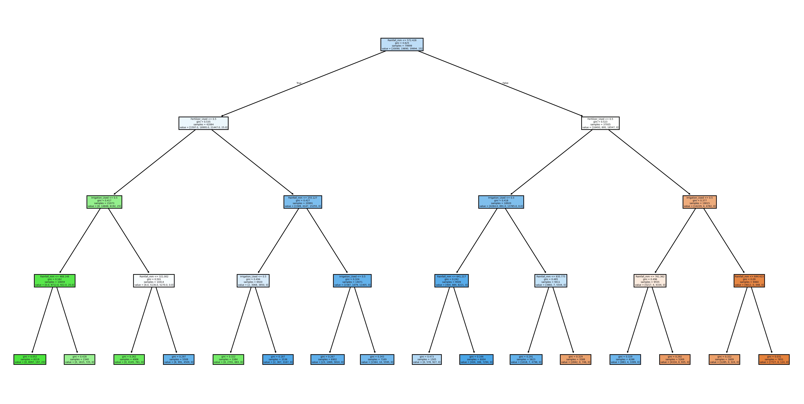

# Harvest Vision
This project uses data from Kaggle to predict crop yields. The data and scripts used in this project are based on the work by [Mohamed Ayman El-Khatib](https://www.kaggle.com/code/mohamedaymanelkhatib/harvest-vision).

## Dataset Overview
This dataset contains agricultural data for 1,000,000 samples aimed at predicting crop yield (in tons per hectare). It can be used for regression tasks in machine learning, especially for predicting crop productivity. The dataset includes the following features:

- **Region**: The geographical location where the data was collected.
- **Soil Type**: The type of soil (e.g., sandy, clay, loamy).
- **Crop Type**: The type of crop grown (e.g., wheat, corn, rice).
- **Rainfall (mm)**: Total rainfall in millimeters.
- **Temperature (C)**: Average temperature in degrees Celsius.
- **Fertilizer Usage (kg)**: Amount of fertilizer applied.
- **Irrigation Usage**: Whether irrigation was applied or not.
- **Weather Conditions**: Summary of weather during the growing period.
- **Days to Harvest**: The number of days between planting and harvesting.
- **Target Variable**: Crop yield in tons per hectare.

## Algorithms and Techniques Used

### 1. Decision Tree Regression
A decision tree regressor was implemented to model the relationship between the features and the target variable. The decision tree visually displays the decision-making process and is highly interpretable.

### 2. Logistic Regression and Linear SVM
Logistic Regression and Linear SVM classifiers were added to convert the yield prediction into a classification task, evaluating performance with accuracy metrics.

### 3. Confusion Matrix
Confusion matrices are used to assess classifier performance, providing insights into true positives, false positives, etc., for the classification task.

### 4. Outlier Detection
Outliers were detected and handled using the interquartile range (IQR) method to ensure dataset integrity.

### 5. Correlations
The Pearson correlation coefficient was calculated to understand linear relationships between features, aiding in feature selection.

### 6. Normal Distributions
The distribution of numerical features (e.g., rainfall, temperature) was analyzed for normality, with visualizations like histograms and kernel density plots.

### 7. Learning Curves
Learning curves were implemented to evaluate model performance as a function of training data size, helping diagnose overfitting and underfitting.

## Visualization
### Decision Tree
Below is a placeholder for the decision tree visualization generated during the project. The tree helps in understanding feature importance and decision paths:

### Additional Visualizations
- **Distributions and Box Plots**: Histograms with kernel density estimates and box plots for numerical features (e.g., Rainfall_mm, Temperature_Celsius) to analyze distributions and detect outliers.
- **Learning Curves**: Plots showing training and cross-validation accuracy for each model (e.g., Decision Tree, Logistic Regression) to assess generalization. Placeholders for these plots are below:

  - 
  - 
  - 
  - 
  - 
  - 

## How to Run
1. Clone this repository.
2. Open `harvest vision.ipynb` in Jupyter Notebook.
3. Run all cells to preprocess the data, train the models, generate visualizations, and evaluate results.

